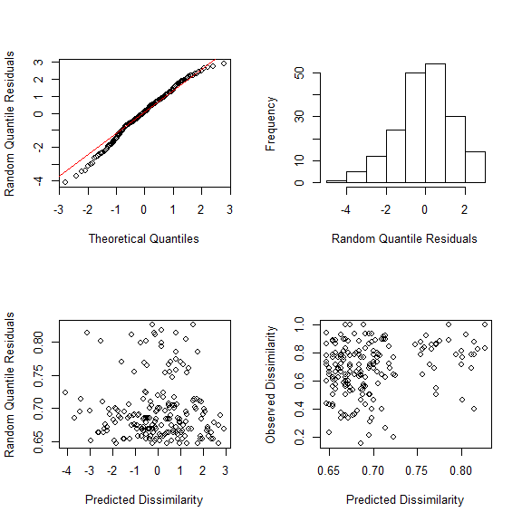
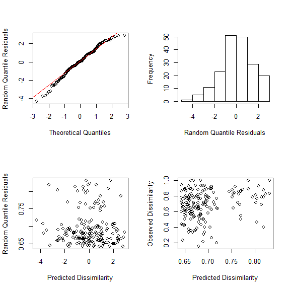
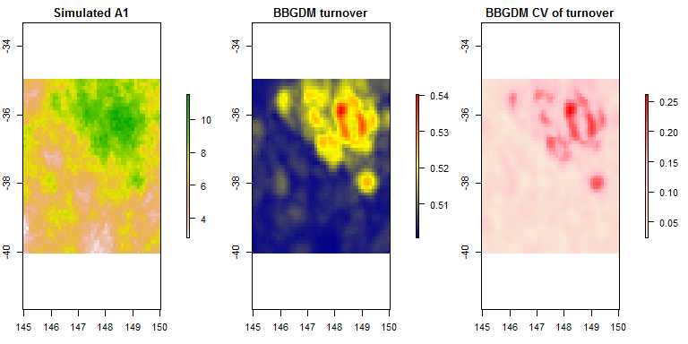

### BBGDM

[](https://travis-ci.org/skiptoniam/bbgdm)

BBGDM is a R package for running Generalized Dissimilarity Models with Bayesian Bootstrap for parameter estimation. To install package run the following command in your R terminal

``` r
install.packages(c('devtools'))
devtools::install_github('skiptoniam/bbgdm')
```

##### Load the required libraries, we need vegan for the dune dataset.

``` r
library(bbgdm)
library(vegan)
```

##### Run bbgdm on the famous dune meadow data

The dune meadow vegetation data, dune, has cover class values of 30 species on 20 sites. Make the abundance data presence/absence.

``` r
data(dune)
data(dune.env)
dune_pa <- ifelse(dune>0,1,0)
```

##### Fit a bbgdm

Now we have a species by sites matrix of simulated data and a set data for a one dimensional gradient.

``` r
form <- ~1+A1
fm1 <- bbgdm(form,dune_pa, dune.env,family="binomial",link='logit',
             dism_metric="number_non_shared",spline_type = 'ispline',
             nboot=100, geo=FALSE,optim.meth='nlmnib')
```

##### Plot diagnostics

``` r
resids <- diagnostics(fm1)
par(mfrow=c(2,2))
plot(resids)
```



##### Plot response curves

``` r
response <- as.response(fm1)
par(mfrow=c(1,1))
plot(response)
```



##### Run 'Wald-like' test on parameters

``` r
library(xtable)
wt <- bbgdm.wald.test(fm1)
tab <- xtable(wt)
print(tab, type = "html")
```

<!-- html table generated in R 3.2.2 by xtable 1.8-2 package -->
<!-- Tue Jul 05 18:04:37 2016 -->
<table border="1">
<tr>
<th>
</th>
<th>
bbgdm\_W
</th>
<th>
bbgdm\_df
</th>
<th>
bbgdm\_p-value
</th>
</tr>
<tr>
<td align="right">
intercept
</td>
<td align="right">
10.13
</td>
<td align="right">
1.00
</td>
<td align="right">
0.00
</td>
</tr>
<tr>
<td align="right">
A1
</td>
<td align="right">
1.61
</td>
<td align="right">
3.00
</td>
<td align="right">
0.66
</td>
</tr>
</table>
##### Predict BBGDM model

``` r
#generate some random spatial autocorrelated data.
library(raster)
set.seed(123)
xy <- expand.grid(x=seq(145, 150, 0.1), y=seq(-40, -35, 0.1))
d <- as.matrix(dist(xy))
w <- exp(-1/nrow(xy) * d)
ww <- chol(w)
xy$z <- t(ww) %*% rnorm(nrow(xy), 0, 0.1)
xy$z <- scales::rescale(xy$z,range(dune.env$A1))
coordinates(xy) <- ~x+y
r <- rasterize(xy, raster(points2grid(xy)), 'z')
#give it the same name as variable in bbgdm model.
names(r)<- 'A1'
r2 <- raster(r)
res(r2) <- 0.05
r2 <- resample(r, r2)
#use this layer to predict turnover.
pred.dune.sim.dat <- predict.bbgdm(fm1,r2,uncertainty = TRUE)
```

    ## using default three cell neighbourhood to estimate dissimilarity

``` r
#plot the data and the turnover predictions, and error.
colram <- colorRampPalette(c("darkblue","yellow","red"))
colram.se <- colorRampPalette(c('antiquewhite','pink','red'))
par(mfrow=c(1,3),mar=c(3,2,2,6))
plot(r2,main='Simulated A1')
plot(pred.dune.sim.dat[[1]],col=colram(100),main='BBGDM turnover')
plot(pred.dune.sim.dat[[2]],col=colram.se(100),main='BBGDM CV of turnover')
```


